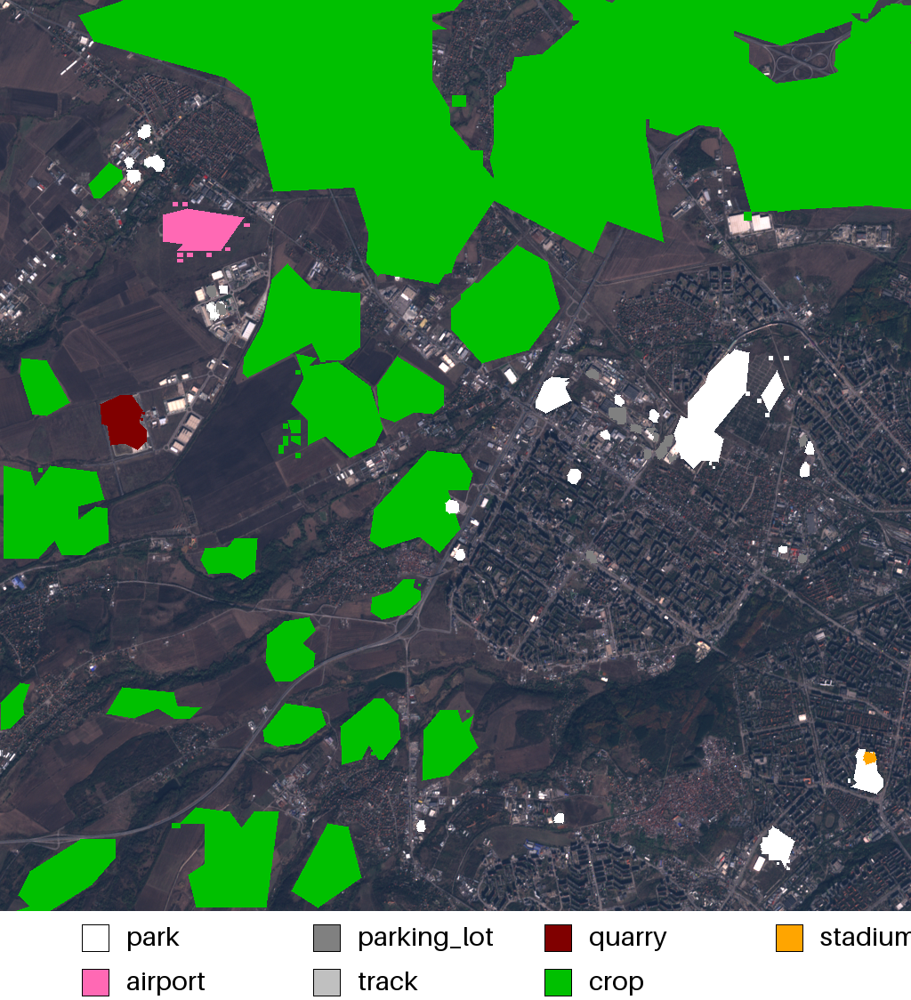
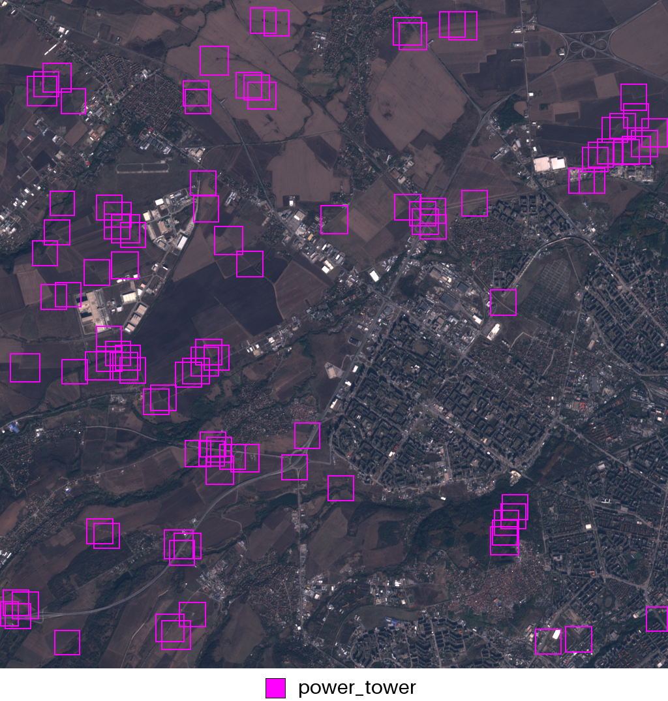

# Satlas Simplified Interface

Welcome to the simplified interface for the Satlas model. This library is a user-friendly fork designed to facilitate the analysis of satellite imagery using the Sentinel 2 RGB Single Image model. 

Original Authors: [Allen Institute for AI](https://satlas.allen.ai/)

Original repository [HERE](https://github.com/allenai/satlas)

Original paper [HERE](https://arxiv.org/abs/2211.15660)

## Installation

Clone this repository to get started:

```bash
git clone https://github.com/tnedev/satlas.git
cd satlas
pip install -r requirements.txt
```

## Usage
The library offers an intuitive API for various tasks such as polygon detection, point detection, and image classification.

### Image requirements
The input image must be a 3-channel RGB image from the Sentinel 2 satellite.
* Resolution is expected to be 10m per pixel.
* Support of png, jpg, tiff, jp2
* Large images will be split in 1024x1024 pixel sections and then the result will be put back to the original size.

### Load the Image
```python
from satlas_interface import Satlas

sat = Satlas()
sat.load_image('./images/test_image.png')
```

### Polygon Task
Detect and visualize polygon features like parks or parking lots.

```python
# Run results on Polygon task
sat.evaluate(task=Satlas.Task.POLYGON, add_legend=True)
```

### Point Task
Identify point features such as the locations of power towers.

```python
# Run results on Point task
sat.evaluate(task=Satlas.Task.POINT, add_legend=True)
```

### Classification Task
Classify the main feature of the entire image with categories like different sports in a park.

```python
# Run results on PARK_SPORT (classification) task
sat.evaluate(task=Satlas.Task.PARK_SPORT)
```

## Example Results
Using images/test_image.png as input, here are the example outputs for each task:

### Polygon Task Output


### Point Task Output


### Classification Task Output
For the PARK_SPORT classification task, the output might look like:

```commandline
american_football: 0.51%
badminton: 0.14%
baseball: 7.47%
basketball: 20.98%
cricket: 0.81%
rugby: 0.53%
soccer: 34.22%
tennis: 33.64%
volleyball: 1.7%
```


